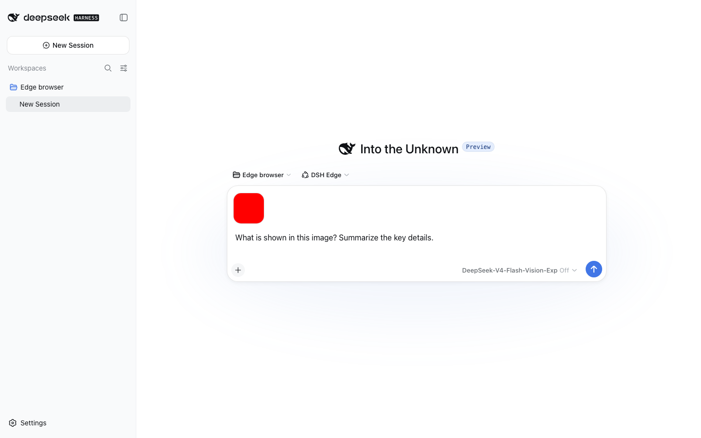

# dsh-edge

[](https://www.npmjs.com/package/dsh-edge)
[](https://github.com/pawaca/dsh-edge/actions/workflows/edge-ci.yml)
[](LICENSE)

English | [中文](README.zh.md)

## DeepSeek Harness in any browser, deployed with one command

`dsh-edge` runs the published DeepSeek Harness Web experience on Cloudflare Workers, so your personal coding agent is available wherever you have a browser. No server to maintain, GitHub repository to connect, or build pipeline to configure.

It keeps the upstream UI, agent loop, model selection, image experience, and Web Search. dsh-edge supplies only the Cloudflare runtime, durable workspace, owner login, and guided installer.



> **Independent community project:** `dsh-edge` is maintained by [pawaca](https://github.com/pawaca). It is not affiliated with or endorsed by DeepSeek. [DeepSeek Harness](https://github.com/deepseek-ai/deepseek-harness) is the upstream project.

## Start in one command

You need Node.js 22.14 or newer and your own DeepSeek API key:

```sh
npx dsh-edge install
```

The installer guides you through every choice and deploys the Worker. You can try it without an existing Cloudflare login, or install it permanently in your own Cloudflare account. No source checkout is required.

## What you get

- Persistent conversations and workspaces from any browser.
- DeepSeek V4 Flash, V4 Pro, and the experimental V4 Flash Vision Exp model through the upstream selector.
- PNG/JPEG image input and DeepSeek's native Web Search tool.
- A persistent `/workspace` with the native DSH `bash` tool.
- Your own Cloudflare deployment, credentials, and data.
- In-place upgrades without a repository or Cloudflare Builds integration.

## Choose your deployment

| Path | What you need | Best for |
| --- | --- | --- |
| **Try now** | No existing Cloudflare login; claim within 60 minutes to keep it | Exploring the complete experience with the lowest friction |
| **Keep it** | An existing or new Cloudflare account with R2 enabled | A long-lived personal deployment |

The default **Free — Direct Shell** runtime works on Cloudflare Workers Free. The optional **Isolated — Dynamic Worker** runtime executes commands in a separate Worker and requires Workers Paid. Both modes use the same product UI, conversations, workspace, images, and tools; Direct Shell is a sandboxed shell runtime, not a Linux container.

## Upgrade

```sh
npx dsh-edge upgrade
```

The installer finds your Worker and upgrades it in place while preserving its durable data. See the [release notes](docs/releases/0.3.0.md) for version-specific details.

## Important boundaries

- dsh-edge is designed for one owner; it does not provide registration, multiple users, roles, or tenant routing.
- Your DeepSeek key is stored as a secret in your Cloudflare Worker, and the deployment's durable data stays in your Cloudflare account.
- Vision Exp is experimental and account-dependent. Some upstream capabilities are not yet adapted to Edge; see the [compatibility matrix](apps/dsh-edge/README.md#cloudflare-compatibility-matrix) for the current status.

## Built on DeepSeek Harness

dsh-edge wraps exact published DeepSeek Harness packages instead of copying its monorepo. Upstream remains responsible for the Web UI, plugin composition, agent loop, and session protocols; this repository implements the Cloudflare runtime and storage adapters needed to run them at the edge.

For the upstream architecture and plugin APIs, see the [DeepSeek Harness repository](https://github.com/deepseek-ai/deepseek-harness) and [reference documentation](https://deepseek-harness.github.io/deepseek-harness/reference/).

## Documentation

- [Runtime reference, compatibility, security, and limits](apps/dsh-edge/README.md)
- [dsh-edge 0.3 release notes](docs/releases/0.3.0.md)
- [DeepSeek Harness upstream documentation](https://deepseek-harness.github.io/deepseek-harness/reference/)

## Develop locally

Source checkout is only required for development. The repository toolchain requires Node.js `^22.19.0` or `>=24.0.0`:

```sh
git clone https://github.com/pawaca/dsh-edge.git
cd dsh-edge
pnpm install
pnpm --dir apps/dsh-edge/standalone install --frozen-lockfile
pnpm run check
```

See the [local Edge setup](apps/dsh-edge/README.md#run-locally) to run the Worker locally.

## Contributing and support

- Report dsh-edge bugs and installation problems in [Issues](https://github.com/pawaca/dsh-edge/issues).
- Report vulnerabilities through the [private security process](SECURITY.md), not a public Issue.
- Follow [CONTRIBUTING.md](CONTRIBUTING.md) and [AGENTS.md](AGENTS.md) when changing the repository.

## License

[MIT](LICENSE). Third-party components and their licenses are listed in [THIRD_PARTY_NOTICES.md](THIRD_PARTY_NOTICES.md).
